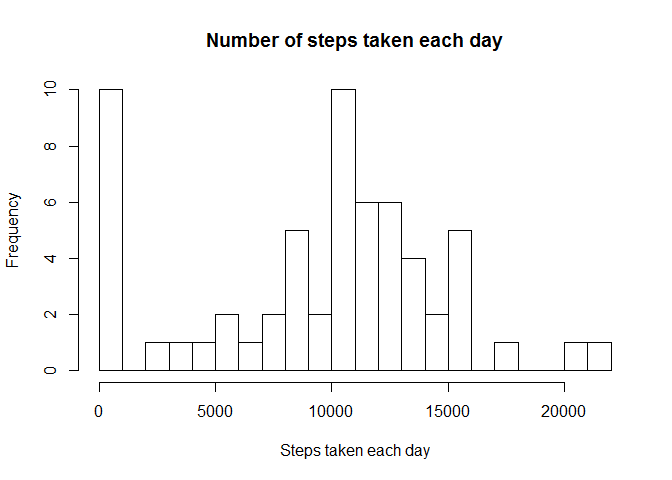
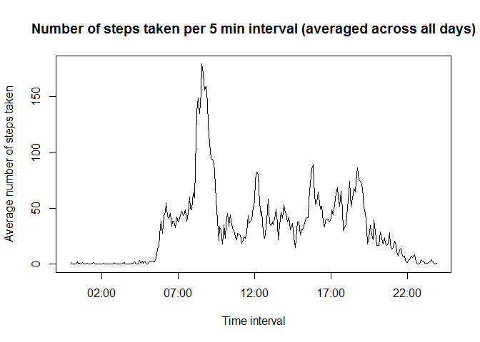
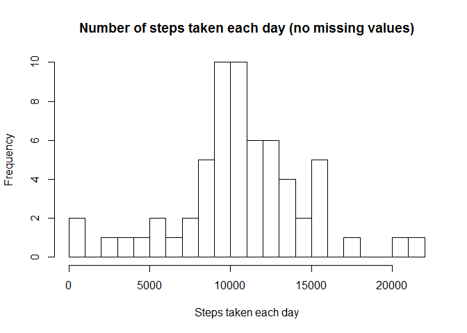
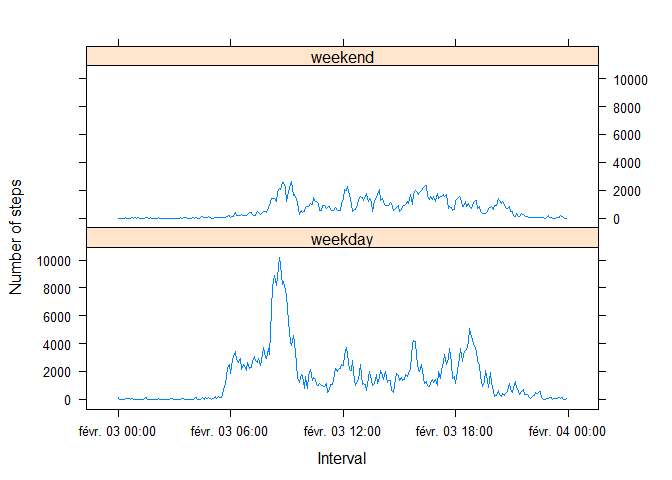

# Reproducible Research: Peer Assessment 1


## Loading and preprocessing the data
  
- Setting the working directory
- Reading the data file through the read.csv command
- Creating a 4th column with the date as a Date class
  

```r
setwd("C:/Users/Rémy/Documents/Assignment/RepData_PeerAssessment1")
activity <- read.csv("activity.csv", header=TRUE)
activity$date2 <- as.Date(activity$date)
```

## What is mean total number of steps taken per day?

Requiring the dplyr package:


```r
require(dplyr)
require(lattice)
require(knitr)
```

Obtaining the total number of steps every day with a for loop:


```r
ac_lvl <- levels(activity$date)
steps_day <- c()
for(i in 1:length(ac_lvl)) {
    a <- sum(filter(activity, date == ac_lvl[i])$steps, na.rm=TRUE)
    steps_day <- c(steps_day,a)
}
```

Creating a histogram of the total number of steaps taken each day:


```r
hist(steps_day, breaks=20, main="Number of steps taken each day", xlab="Steps taken each day")
```

 

Calculating and reporting the mean and median of the total number of steps taken per day:


```r
steps_mean <- round(mean(steps_day), digits=0)
steps_median <- median(steps_day)
```

The subject walks an average of **9354** steps per day.
The median number of steps taken per day is **10395**.

## What is the average daily activity pattern?

Obtaining the average number of steps taken, averaged across all days with a for loop:


```r
steps_interval <- c()
nb_days <- length(levels(activity$date))
k <- levels(as.factor(activity$interval))
for(i in 1:length(k)) {
    a <- sum(filter(activity, interval == k[i])$steps, na.rm=TRUE)/nb_days
    steps_interval <- c(steps_interval,a)
}
```

Plotting the average number of steps per interval and the 5-minutes intervals. Creatting a vector wit the time intervals in a more appropriate format:


```r
t <- seq(ISOdatetime(2001,2,3,0,0,0), ISOdatetime(2001,2,3,23,55,0), by=(60*5))
plot(x=t, y=steps_interval, type="l", xlab="Time interval", ylab="Average number of steps taken", main="Number of steps taken per 5 min interval (averaged across all days)")
```

 

Retrieving the 5 min interval which, on average across all the days in the dataset, contains the maximum number of steps:


```r
t <- format(t,"%H:%M")
interval_max <- t[which.max(steps_interval)]
interval_max_bis <- t[which.max(steps_interval)+1]
```

It's between **08:35** and **08:40** that the subject walks the most on average across all days.

## Imputing missing values 

Retrieving the number of rows where there is a NA value:


```r
sum(rowSums(is.na(activity)) >= 1)
```

```
## [1] 2304
```

I'm going to fill all the missing values with the average number of steps taken per day divided by the number of intervals per day (288). I'm going to fill the NA values with the average number of steps per day. I'm going to copy the existing dataset and fill the NA values:


```r
activity2 <- activity
for(i in 1:nrow(activity2)) {
    if(is.na(activity2$steps[i])) {
        activity2$steps[i] <- steps_interval[(i-1)%%288+1]
    }
}
```

Verifying that there are no more NA values:


```r
sum(rowSums(is.na(activity2)) >= 1)
```

```
## [1] 0
```

Plotting the new histogram and reporting the new mean and median number of steps taken per day. I'm going to use the previous code chunks:


```r
ac_lvl2 <- levels(activity2$date)
steps_day2 <- c()
for(i in 1:length(ac_lvl2)) {
    a <- sum(filter(activity2, date == ac_lvl2[i])$steps)
    steps_day2 <- c(steps_day2,a)
}
```


```r
hist(steps_day2, breaks=20, main="Number of steps taken each day (no missing values)", xlab="Steps taken each day")
```

 


```r
steps_mean2 <- round(mean(steps_day2), digits=0)
steps_median2 <- median(steps_day2)
```

The subject walks an average of **1.0581\times 10^{4}** steps per day.
The median number of steps taken per day is **1.0395\times 10^{4}**.

The average number of steps taken increases as it was expected. It is conform to the evolution of the histogram.

## Are there differences in activity patterns between weekdays and weekends?

Creating a new column in the activity2 data frame to identify weekdays and weekend days usign the weekdays() function:


```r
for(i in 1:nrow(activity2)) {
    if(weekdays(x=activity2$date2[i], abbreviate =TRUE)=="sam."|
            weekdays(x=activity2$date2[i], abbreviate =TRUE)=="dim.") {
        activity2$daytype[i] <- "weekend"
    }
    else {
        activity2$daytype[i] <- "weekday"
    }
}
head(activity2, n=1L)
```

```
##      steps       date interval      date2 daytype
## 1 1.491803 2012-10-01        0 2012-10-01 weekday
```

```r
tail(activity2, n=1L)
```

```
##           steps       date interval      date2 daytype
## 17568 0.9344262 2012-11-30     2355 2012-11-30 weekday
```

Plotting 2 graphs representing the 5-minute interval and the average number of steps taken, averaged across all weekday days or weekend days. In order to do this, I'm going to use chunks of code made before. First, I'm creatign a vector containing the number of steps per interval averaged across all weekdays and then  all weekend days:


```r
steps_interval_WD <- c()
steps_interval_WE <- c()
k <- levels(as.factor(activity2$interval))
for(i in 1:length(k)) {
    a <- mean(sum(filter(activity2, interval == k[i] & daytype == "weekday")$steps))
    steps_interval_WD <- c(steps_interval_WD,a)
    b <- mean(sum(filter(activity2, interval == k[i] & daytype == "weekend")$steps))
    steps_interval_WE <- c(steps_interval_WE,b)
}
```

Now plotting the 2 vectors obtained:


```r
t <- seq(ISOdatetime(2001,2,3,0,0,0), ISOdatetime(2001,2,3,23,55,0), by=(60*5))
data_plot <- data.frame(interval=c(k,k),time=c(t,t),steps=c(steps_interval_WD,steps_interval_WE), daytype=rep(c("weekday","weekend"), each=288))
xyplot(steps ~ time | daytype, data=data_plot, type="l", layout=c(1,2), xlab="Interval", ylab="Number of steps")
```

 
